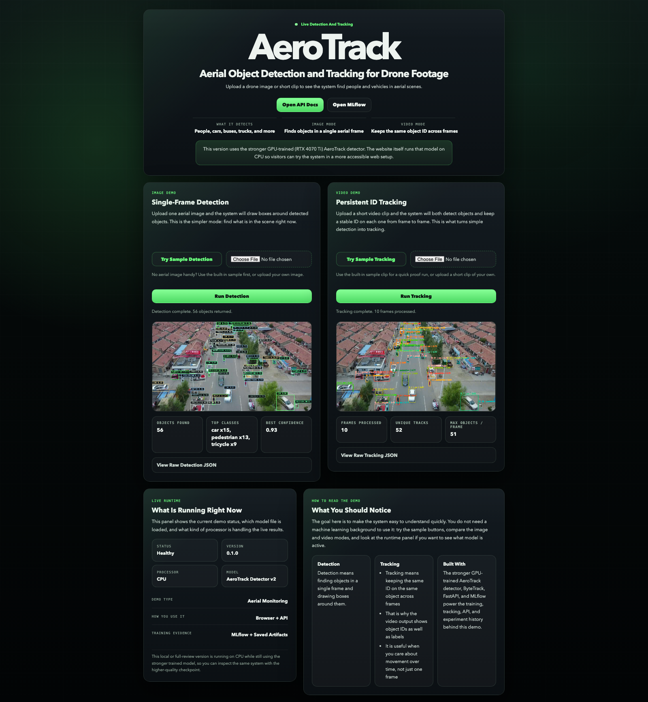

# AeroTrack

[](https://github.com/joshleh/aerotrack/actions/workflows/ci.yml)

`AeroTrack` is an end-to-end MLOps pipeline for multi-object detection and tracking on aerial drone footage using YOLOv8, ByteTrack, FastAPI, MLflow, Docker, and VisDrone.

Current status: the full system is operational and browser-demo ready. The repo includes the stronger RTX 4070 Ti-trained checkpoint at `models/aerotrack-detector-demo-v2.pt` for local evaluation and a lighter `yolov8n.pt` option for CPU-friendly hosted demos.



## Model Performance

These metrics come from the saved RTX 4070 Ti validation run documented in [docs/gpu_training_summary.md](docs/gpu_training_summary.md). Regenerate the full report, including the stock baseline row, with:

```bash
python scripts/evaluate_mAP.py
```

| Model | Role | mAP@0.5 | mAP@0.5:0.95 | Lowest AP@0.5 classes |
| --- | --- | ---: | ---: | --- |
| AeroTrack YOLOv8m fine-tune | VisDrone fine-tuned detector | 0.549 | 0.349 | awning-tricycle (0.250), bicycle (0.334), tricycle (0.455) |
| Stock YOLOv8n | Zero-shot COCO baseline | pending | pending | Run `scripts/evaluate_mAP.py` |

VisDrone is a hard aerial dataset: objects are small, dense, occluded, and viewed from unusual top-down angles. Published VisDrone mAP@0.5 numbers for strong detectors are often around `0.40-0.50`, depending on protocol, model scale, and evaluation settings, so the `0.549` project-local Ultralytics validation result should be verified before making a public leaderboard-style claim. This detector is strongest on larger, visually consistent classes such as `car` and `bus`; it struggles most on `bicycle`, `tricycle`, and `awning-tricycle`, where small object size and class ambiguity make both localization and classification harder.

Detailed per-class tables live in [docs/model_performance.md](docs/model_performance.md).

## Edge Deployment (ONNX)

Export the trained checkpoint to ONNX and benchmark available runtimes:

```bash
python scripts/export_onnx.py
python scripts/benchmark_inference.py
```

| Backend | Device | Mean latency (ms) | Throughput (FPS) | Warmup | Iterations |
| --- | ---: | ---: | ---: | ---: | ---: |
| PyTorch | CPU | pending local run | pending local run | 10 | 100 |
| PyTorch | GPU, if available | pending local run | pending local run | 10 | 100 |
| ONNX Runtime | CPU | pending local run | pending local run | 10 | 100 |
| ONNX Runtime | GPU, if available | pending local run | pending local run | 10 | 100 |

ONNX matters for edge deployment because it turns the PyTorch checkpoint into a runtime-agnostic graph with a smaller serving footprint and a path into hardware acceleration stacks such as TensorRT and OpenVINO. ONNX Runtime gives portable execution; TensorRT goes further by compiling a hardware-specific engine with kernel fusion, FP16/INT8 quantization, and GPU-specific optimization. The expected next step is TensorRT INT8 quantization on a Jetson-class device, trading lower latency and power draw against possible mAP degradation from reduced numeric precision.

The benchmark report is generated at [docs/inference_benchmarks.md](docs/inference_benchmarks.md).

## Architecture

```text
                    +-----------------------------+
                    |      VisDrone2019-DET       |
                    |  download -> convert YOLO   |
                    +-------------+---------------+
                                  |
                                  v
                    +-------------+---------------+
                    |         src/train.py        |
                    | YOLOv8 fine-tuning          |
                    | MLflow params + metrics     |
                    +-------------+---------------+
                                  |
                                  v
                    +-------------+---------------+
                    |        MLflow Server        |
                    | runs, plots, artifacts,     |
                    | model registry metadata     |
                    +-------------+---------------+
                                  |
               +------------------+------------------+
               |                                     |
               v                                     v
     +---------+----------+               +----------+----------+
     |   src/predict.py   |               |    src/track.py     |
     | single-frame det   |               | YOLO + ByteTrack    |
     +---------+----------+               +----------+----------+
               |                                     |
               +------------------+------------------+
                                  |
                                  v
                    +-------------+---------------+
                    |         FastAPI API         |
                    |    /detect and /track       |
                    +-----------------------------+
```

| Layer | Tooling |
| --- | --- |
| Detection | Ultralytics YOLOv8 |
| Tracking | Supervision ByteTrack |
| Inference API | FastAPI |
| Experiment tracking | MLflow |
| CV / DL runtime | OpenCV, PyTorch, ONNX Runtime |
| Packaging | Docker, docker-compose |
| Dataset | VisDrone2019-DET |

This project is intentionally framed around Anduril-relevant capabilities: aerial perception, persistent multi-object tracking, real-time inference APIs, reproducible training, model artifact management, and deployment-oriented packaging. The sister project `FusionTrack` handles sensor-fusion math; AeroTrack focuses on detection, tracking, and serving.

## Robustness

The most deployment-oriented artifact is [notebooks/02_robustness.ipynb](notebooks/02_robustness.ipynb). It loads representative VisDrone validation frames, applies progressive synthetic fog, low light, and motion blur with Albumentations, runs the detector on original and degraded images, and plots detection retention by severity.

Those degradations map to operational conditions:

- fog: low-visibility ISR
- low light: dusk, night, or underexposed collection
- motion blur: high-speed platform motion, vibration, or camera slew

Run it locally with:

```bash
jupyter notebook notebooks/02_robustness.ipynb
```

## How To Run

Clone the repository:

```bash
git clone https://github.com/joshleh/aerotrack.git
cd aerotrack
```

Create a local environment file:

```bash
cp .env.example .env
```

Recommended local values:

```dotenv
API_HOST=0.0.0.0
API_PORT=8000
AEROTRACK_MODEL_PATH=models/aerotrack-detector-demo-v2.pt
AEROTRACK_DEVICE=cpu
AEROTRACK_CONFIDENCE=0.25
AEROTRACK_IOU=0.45
AEROTRACK_OUTPUT_DIR=/app/outputs
MLFLOW_TRACKING_URI=http://mlflow:5000
MLFLOW_EXPERIMENT_NAME=aerotrack-yolov8
MLFLOW_MODEL_NAME=aerotrack-detector
MLFLOW_BACKEND_STORE_URI=sqlite:////mlflow/mlflow.db
MLFLOW_ARTIFACT_ROOT=/mlflow/artifacts
```

Install Python dependencies for local scripts:

```bash
python -m pip install -r requirements.txt
```

Download and prepare VisDrone:

```bash
chmod +x scripts/download_visDrone.sh
./scripts/download_visDrone.sh
```

Windows PowerShell:

```powershell
.\scripts\download_visDrone.ps1
```

Build and start the API plus MLflow stack:

```bash
docker-compose up --build
```

Verify the API:

```bash
curl http://localhost:8000/health
```

Expected response:

```json
{"status":"ok"}
```

Open the browser demo:

```text
http://localhost:8000/
```

The homepage includes built-in sample media, so visitors can test both detection and tracking without uploading their own drone footage first.

## Inference API

Single-frame detection:

```bash
curl -X POST "http://localhost:8000/detect" \
  -H "accept: application/json" \
  -F "file=@/absolute/path/to/frame.jpg"
```

Example response:

```json
{
  "detections": [
    {
      "bbox": [113.6, 87.2, 164.9, 141.0],
      "class_id": 3,
      "class_label": "car",
      "confidence": 0.9142
    }
  ]
}
```

Clip-level tracking:

```bash
curl -X POST "http://localhost:8000/track" \
  -H "accept: application/json" \
  -F "file=@/absolute/path/to/clip.mp4"
```

Example response:

```json
{
  "frames": [
    {
      "frame_index": 0,
      "objects": [
        {
          "track_id": 7,
          "bbox": [114.3, 87.0, 166.2, 140.8],
          "class_id": 3,
          "class_label": "car",
          "confidence": 0.91
        }
      ]
    }
  ],
  "annotated_video_path": "/app/outputs/clip_tracked.mp4",
  "metadata": {
    "source_filename": "clip.mp4",
    "annotated_video_url": "/artifacts/clip_tracked.mp4"
  }
}
```

Create a short smoke-test clip from a single image:

```bash
python scripts/make_smoke_clip.py \
  --image data/raw/VisDrone2019-DET-val/images/0000271_01401_d_0000380.jpg \
  --output outputs/smoke.mp4
```

## Training And Evaluation

Run training locally from the repo root:

```bash
python -m src.train \
  --data data/visdrone/VisDrone.yaml \
  --epochs 50 \
  --imgsz 1024 \
  --batch 8 \
  --lr 0.001 \
  --mlflow-tracking-uri "$MLFLOW_TRACKING_URI"
```

Run a reduced Docker smoke training pass:

```bash
docker-compose exec api python -m src.train \
  --data data/visdrone/VisDrone.yaml \
  --epochs 1 \
  --imgsz 640 \
  --batch 2 \
  --mlflow-tracking-uri http://mlflow:5000
```

Evaluate mAP:

```bash
python scripts/evaluate_mAP.py
```

Export ONNX:

```bash
python scripts/export_onnx.py
```

Benchmark inference:

```bash
python scripts/benchmark_inference.py
```

Open MLflow at [http://localhost:5001](http://localhost:5001) to inspect runs, compare metrics, and browse artifacts.

## Dataset Setup

The repository includes a reproducible VisDrone prep flow:

- [data/README.md](data/README.md) explains the official source and expected output structure.
- [scripts/download_visDrone.sh](scripts/download_visDrone.sh) downloads the train, val, and test-dev archives, extracts them, converts annotations into YOLO format, and generates `data/visdrone/VisDrone.yaml`.

The generated YOLO dataset uses these 10 VisDrone classes:

`pedestrian`, `people`, `bicycle`, `car`, `van`, `truck`, `tricycle`, `awning-tricycle`, `bus`, `motor`

Ignored regions are skipped during conversion.

## Repository Layout

```text
aerotrack/
├── api/
├── data/
├── docs/
│   ├── inference_benchmarks.md
│   └── model_performance.md
├── examples/
├── mlflow/
├── models/
│   ├── aerotrack-detector-demo-v2.pt
│   └── aerotrack-detector-validation.pt
├── notebooks/
│   ├── 01_eda.ipynb
│   └── 02_robustness.ipynb
├── scripts/
│   ├── benchmark_inference.py
│   ├── evaluate_mAP.py
│   └── export_onnx.py
├── src/
├── tests/
├── Dockerfile
├── docker-compose.yml
├── requirements.txt
└── README.md
```

## Demo Checklist

For an interview or portfolio walkthrough:

1. Show the README performance and ONNX sections.
2. Run `docker-compose up --build`.
3. Hit `GET /health`.
4. Run `POST /detect` on a VisDrone frame.
5. Run `POST /track` on a short clip and show persistent IDs.
6. Open MLflow and show run history plus logged artifacts.
7. Open `notebooks/02_robustness.ipynb` and explain field degradation testing.

Supporting docs:

- [docs/demo.md](docs/demo.md)
- [docs/demo_capture.md](docs/demo_capture.md)
- [docs/deploy.md](docs/deploy.md)
- [docs/runbook.md](docs/runbook.md)
- [docs/windows_gpu_setup.md](docs/windows_gpu_setup.md)

## Future Work

- Record and embed a short walkthrough video after regenerating the final mAP and inference benchmark tables on the target local environment.
